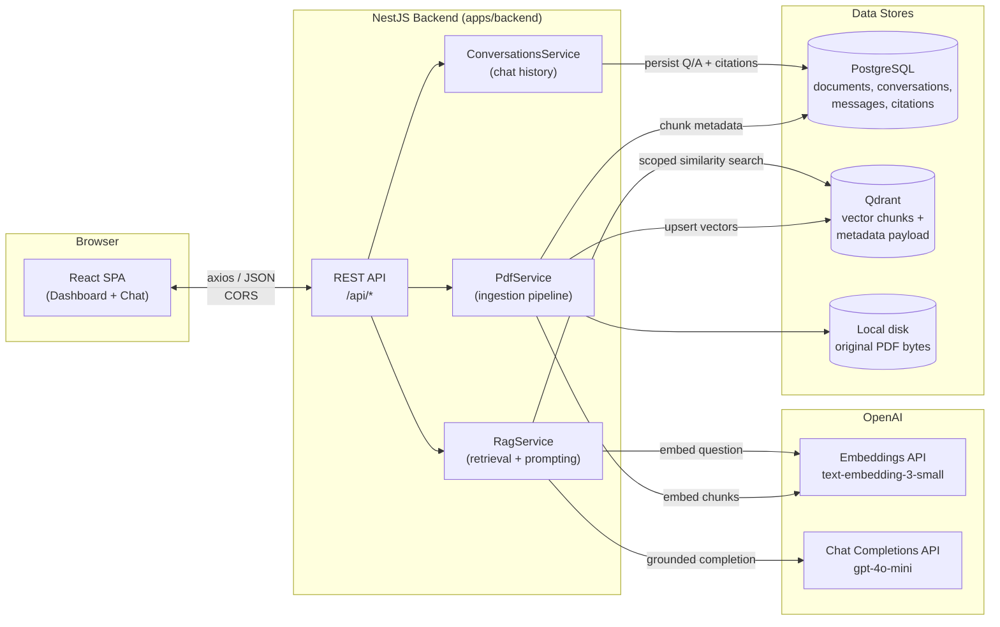
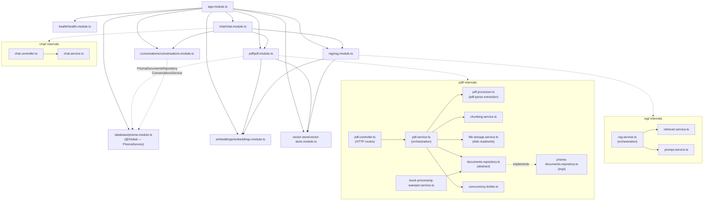
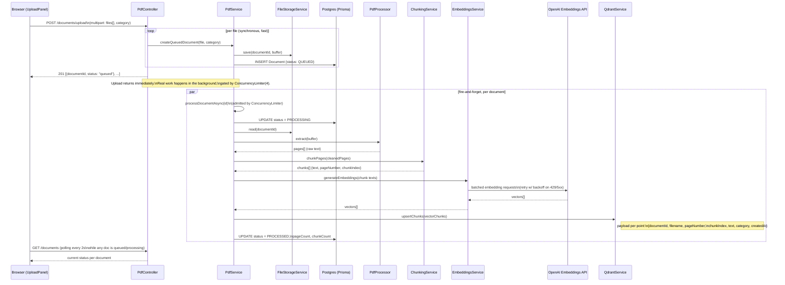
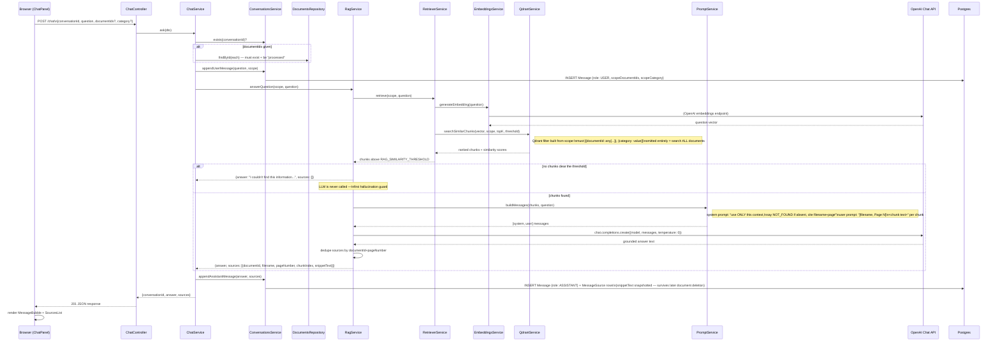
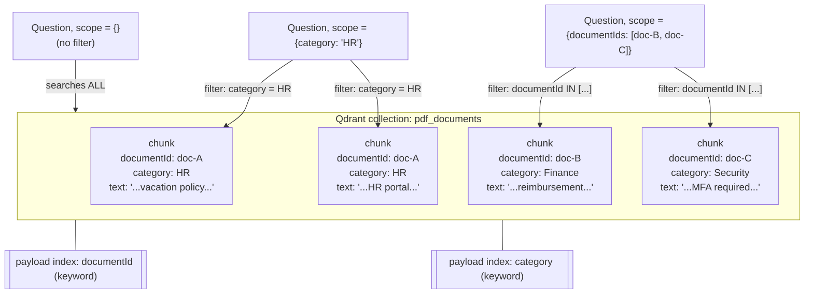
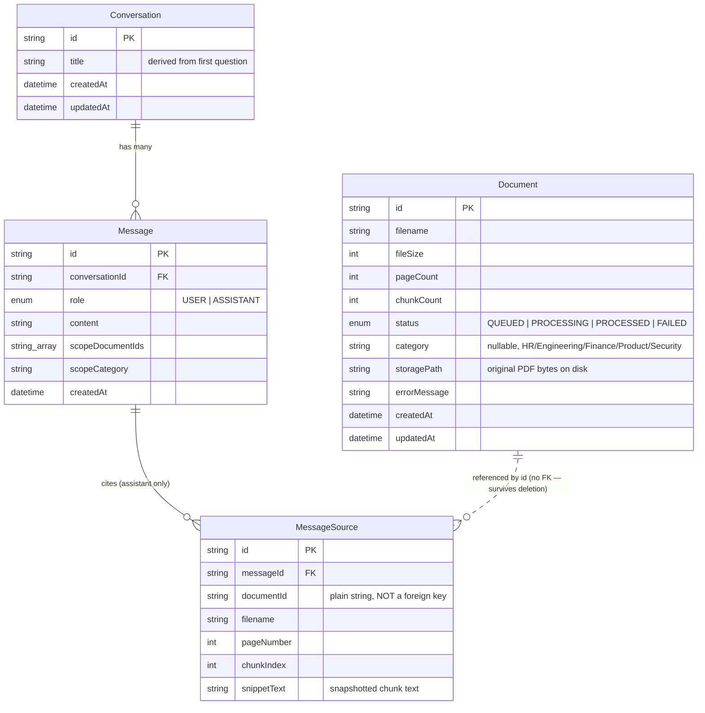
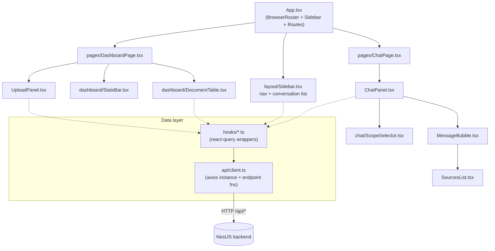

# DocuMind AI — Architecture

A multi-document RAG (Retrieval-Augmented Generation) assistant: upload PDFs, tag them by category, and ask questions that are answered strictly from the retrieved document content, with citations.

**Stack**: React 19 + Vite (frontend) · NestJS 11 (backend) · PostgreSQL + Prisma (metadata/conversations) · Qdrant (vector store) · OpenAI (embeddings + chat)

---

## 1. System Overview



---

## 2. Backend Module Graph — how files talk to each other

Every module is a NestJS `@Module`; arrows are dependency-injection imports (who calls whom). This is the literal file-to-file communication path.



**Key seams:**
- `DocumentsRepository` is an abstract class; `PrismaDocumentsRepository` is the only implementation. Nothing outside `pdf/` talks to Prisma directly for documents — this is the swap point if storage ever changes.
- `QdrantService` (in `vector-store/`) is the *only* file that imports `@qdrant/js-client-rest`. `RetrieverService` and `PdfService` never touch Qdrant's SDK directly.
- `ConcurrencyLimiter` lives inside `PdfService` as a private field — it caps how many documents are actively chunking/embedding/upserting at once (default 4), regardless of how many were queued in one upload batch.

---

## 3. Document Ingestion Pipeline — from upload to searchable vectors



**Chunking**: pages → paragraphs → sentences, accumulated up to `CHUNK_SIZE` tokens (~700, char/4 estimate) with a `CHUNK_OVERLAP` (~120 tokens) sentence tail carried into the next chunk, so context isn't severed mid-thought at chunk boundaries.

**Failure handling**: any exception in the pipeline (corrupt PDF, empty text, embedding API failure, Qdrant failure) sets `status = FAILED` with `errorMessage`; the dashboard exposes **Retry** (re-run from `QUEUED`) and **Re-process** (delete existing vectors, re-run from the stored original bytes — used after a chunking config change).

---

## 4. Chat / RAG Query Flow — how a prompt becomes a grounded answer



**Two hallucination guards**, independent of each other:
1. **Similarity threshold** (`RetrieverService`) — if nothing clears `RAG_SIMILARITY_THRESHOLD`, the LLM is never called at all; the canned "not found" answer is returned directly.
2. **System prompt constraint** (`PromptService`) — even when relevant chunks exist, the model is instructed to answer *only* from the provided context and to say so explicitly if the answer isn't actually in it.

---

## 5. Multi-Document Isolation — how Qdrant keeps documents from leaking into each other

All chunks from every document live in **one Qdrant collection** (`pdf_documents`). Isolation is enforced entirely through **payload filtering**, not separate collections/namespaces per document.



```ts
// vector-store/qdrant.service.ts — filter construction (simplified)
const must = [];
if (scope.documentIds?.length) must.push({ key: 'documentId', match: { any: scope.documentIds } });
if (scope.category)            must.push({ key: 'category',   match: { value: scope.category } });
const filter = must.length ? { must } : undefined; // undefined = whole library
```

- **Default (Dashboard "All documents")** → empty scope → filter omitted → searches every processed document.
- **Category-scoped** ("Search: HR") → `category` filter only.
- **Specific file** → `documentId` filter (`match.any` with a single ID — same code path as multi-file scoping).
- Both filters can combine (AND) — e.g. "these 3 documentIds, but only if they're also tagged Finance."

This is what the HR/Finance/Security isolation test (`rag-pipeline.e2e-spec.ts`) verifies directly: uploading three category-tagged documents and asserting a category-scoped question never returns chunks from a different category, even when another document's content is topically closer.

---

## 6. Data Model (PostgreSQL via Prisma)



**Why `MessageSource.documentId` is not a foreign key**: deleting a `Document` (from the dashboard) must not corrupt past conversation history. `filename`, `pageNumber`, and `snippetText` are snapshotted onto the citation at answer time, so a chat transcript stays fully readable — "here's what it said and why" — even after the source document is gone or re-processed.

The vector store (Qdrant) has no equivalent foreign-key relationship either: chunks are addressed purely by the `documentId` string in their payload, deleted via a payload-filtered `delete` call (`QdrantService.deleteDocument`), independent of the Postgres row's lifecycle.

---

## 7. Frontend Structure



- **Polling, not sockets**: `useDocuments()` uses react-query's `refetchInterval`, active only while any document is `queued`/`processing` — the dashboard's per-row status updates without a page reload, without needing WebSockets.
- **Conversation state lives server-side**: `ChatPanel` has no local message array; `useConversationMessages(conversationId)` fetches the full persisted history on mount/switch, and sending a message invalidates that query so the just-answered turn reloads from Postgres. Reloading the browser mid-conversation loses nothing.
- **Scope selector → API call**: `AskQuestionScope` (`{documentIds?, category?}`) flows from `ScopeSelector` state straight through `useChat()` → `askQuestion()` → the `/chat` POST body, matching the backend's `RetrievalScope` shape one-to-one.

---

## 8. Request Path Cheat Sheet

| Action | Route | Backend chain |
|---|---|---|
| Upload PDFs | `POST /api/documents/upload` | `PdfController` → `PdfService.createQueuedDocument` (sync) → `processDocumentAsync` (async, limiter-gated) |
| List documents (polling) | `GET /api/documents` | `PdfController` → `PdfService.listDocuments` → `PrismaDocumentsRepository` |
| Retry a failed upload | `POST /api/documents/:id/retry` | resets to `QUEUED`, re-enters the same async pipeline |
| Re-process | `POST /api/documents/:id/reprocess` | deletes existing Qdrant vectors for that id, re-reads stored bytes, re-runs pipeline |
| Delete a document | `DELETE /api/documents/:id` | deletes Qdrant vectors → Postgres row → stored file bytes |
| New conversation | `POST /api/conversations` | `ConversationsController` → `ConversationsService.create` |
| Ask a question | `POST /api/chat` | `ChatController` → `ChatService.ask` → `RagService.answerQuestion` → persists via `ConversationsService` |
| Load chat history | `GET /api/conversations/:id` | returns messages + nested `MessageSource[]`, ordered oldest→newest |
